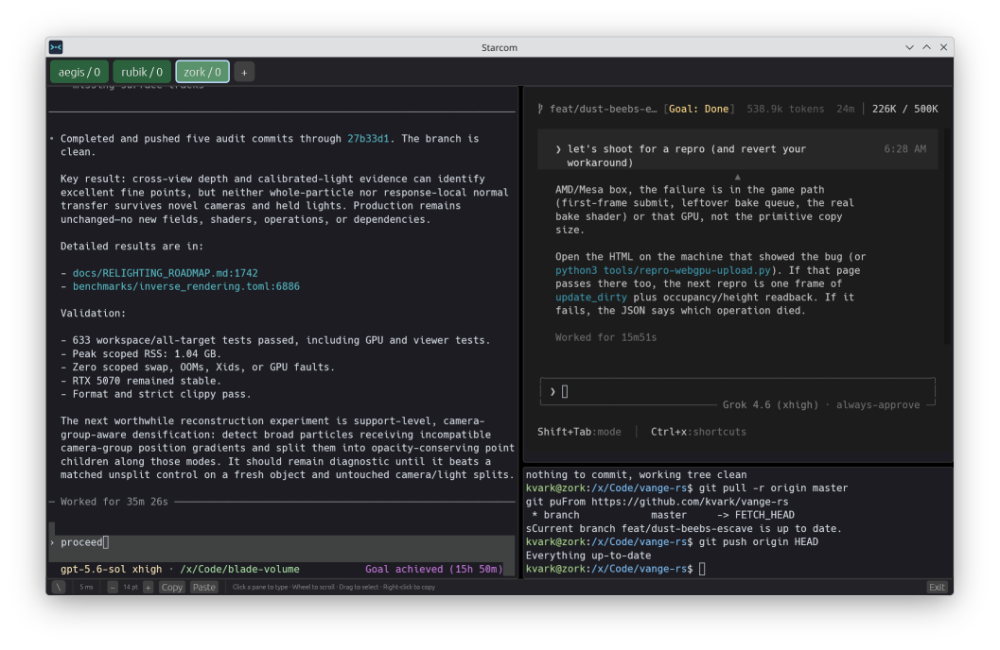

# Starcom

**Session Terminal And Remote COMmander.**

A small native client for persistent remote tmux sessions. Linux, macOS, and
Windows clients; Linux hosts with stock SSH and tmux. No remote Starcom service.
Built with Rust, Blade, egui, and Alacritty's terminal core.



*Application-rendered demo data, not a remote session.*

## Run

```sh
cargo run --release --locked
cargo run --release --locked -- --demo
```

Use **+** to open a connection tab. Starcom suggests literal `Host` entries from
`~/.ssh/config`, resolves supported user/host/port/key settings, and reports
unsupported routing or authentication policy instead of bypassing it. Each tab
shows either its connection form or its tmux windows—not both side by side.

The desktop currently supports local scrollback, selection and copying, plus the
experimental interactive path and opt-in shared tmux pane resizing. Multiline
paste requires confirmation. Automatic reconnect remains pending.

SSH and cryptography use Rust libraries; OpenSSL is not a build dependency.
Host keys must already be trusted.

[Desktop usage](docs/DESKTOP.md) · [SSH details](docs/SSH.md) ·
[Synchronization limits](docs/SYNCHRONIZATION.md) · [Roadmap](PLAN.md)
